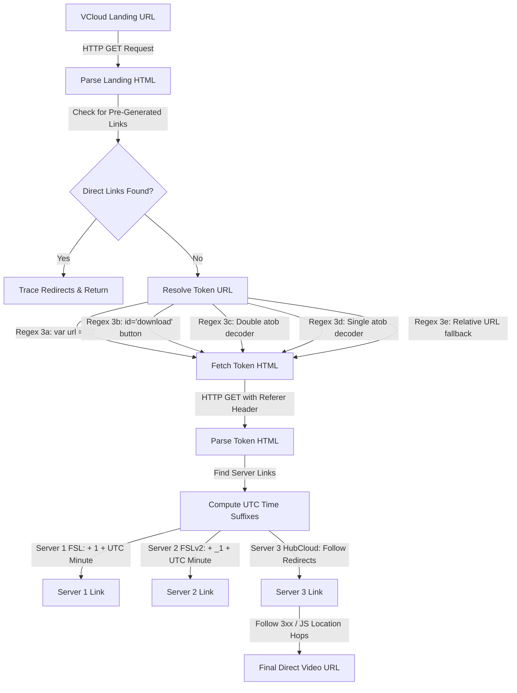

# VCloud Direct Link Extraction Guide (Android Native)

This document provides a detailed breakdown of how the native Android VCloud direct video link extractor operates within the mobile application. It outlines the extraction flow, decoding patterns, regex rules, UTC minute suffix calculations, and recursive redirection tracing—excluding all web-specific or Vercel architectures.

---

## 1. Flow Overview

The extraction process executes entirely in a background worker thread in Java to prevent UI thread blocking and WebView deadlocks.



---

## 2. Core Java Extraction Phases

All actions are located inside the native class [`VCloudExtractor.java`](file:///e:/0.1%20Github%20Repo/Vcoud%20Databse%20Links/android-app/app/src/main/java/com/daniewatch/app/VCloudExtractor.java).

### Step 1: Fetching the Landing Page HTML
The extractor uses a background `Thread` and a standard `HttpURLConnection` client. It forces browser identification by passing a standard Chrome desktop `User-Agent`.

```java
// Run in background thread
new Thread(new Runnable() {
    @Override
    public void run() {
        // Fetch and parse landing HTML...
    }
}).start();
```

---

### Step 2: Immediate Server Link Parsing
The HTML is first parsed using regular expressions to see if the server links are already generated and visible on the landing page (skipping the token step if unnecessary).

```java
resolved = parseServerLinksFromHtml(html);
if (resolved.containsKey("Server 1") || resolved.containsKey("Server 2") || resolved.containsKey("Server 3")) {
    return resolved; // Exit early if already resolved
}
```

---

### Step 3: Finding the Intermediate Token URL
VCloud obfuscates the location of the actual files using five distinct inline patterns. The Java client tests for each of these in sequence:

#### Try 3a: Javascript Variable Assignment
* **Regex Pattern**: `var\s+url\s*=\s*['"](https?://[^'\"]+)['"]` (Case-Insensitive)
* **Target HTML**: `var url = 'https://vcloud.zip/token/xyz...';`

#### Try 3b: Anchor Tag Selector (Button search)
* **Regex Pattern**: Matches anchor tags `<a>` having an `id="download"` attribute or whose inner text contains words like `generate download` or `generate direct download`.

#### Try 3c: Double Base64 JS Obfuscation (`atob(atob('...'))`)
* **Regex Pattern**: `atob\(atob\(['"]([A-Za-z0-9+/=]+)['"]\)\)`
* **Decode logic**: Decodes the base64 string once, then decodes the resulting base64 string a second time using Android's native base64 decoder:
  ```java
  byte[] d1 = android.util.Base64.decode(matchedString, android.util.Base64.DEFAULT);
  byte[] d2 = android.util.Base64.decode(d1, android.util.Base64.DEFAULT);
  tokenUrl = new String(d2, "UTF-8");
  ```

#### Try 3d: Single Base64 JS Obfuscation (`url = atob('...')`)
* **Regex Pattern**: `url\s*=\s*atob\(['"]([A-Za-z0-9+/=]+)['"]\)`
* **Decode logic**:
  ```java
  byte[] d = android.util.Base64.decode(matchedString, android.util.Base64.DEFAULT);
  tokenUrl = new String(d, "UTF-8");
  ```

#### Try 3e: Relative Path fallback
* **Regex Pattern**: `var\s+url\s*=\s*['"]([^'\"]+)['"]`
* **Resolution**: If the matched variable is a relative path (e.g. `/token/xyz`), it resolves it against the initial landing page host using Java's standard `URL` constructor:
  ```java
  URL base = new URL(vcloudUrl);
  URL resolvedUrl = new URL(base, relativeVal);
  tokenUrl = resolvedUrl.toString();
  ```

---

### Step 4: Fetching the Token Page
Once the token URL is obtained, the scraper fetches it. **Crucially, the request must include the `Referer` header matching the original landing page URL**, or the server blocks the request as hotlinking.

```java
headers.put("Referer", vcloudUrl);
String tokenHtml = fetchHtml(tokenUrl, headers);
```

---

### Step 5: Suffix Formatting & Obfuscation Decoding
To prevent long-term direct-linking, VCloud appends time-based minutes to the download URLs. The Java client must compute this suffix matching the server rules:

1. **Calculate the UTC Minute**:
   ```java
   java.util.Calendar cal = java.util.Calendar.getInstance(java.util.TimeZone.getTimeZone("UTC"));
   int currentMinute = cal.get(java.util.Calendar.MINUTE);
   String suffix1 = "1" + currentMinute;
   String suffix2 = "_1" + currentMinute;
   ```

2. **Exclusion Check**:
   If the parsed link is a Cloudflare Storage/R2 URL (contains `x-amz-signature`, `r2.cloudflarestorage`, or `r2.dev`), **no time suffix is applied**.

3. **Append Suffixes**:
   * **Server 1 (FSL)**: Appends `suffix1` (e.g. `145` for minute 45) to the URL.
   * **Server 2 (FSLv2)**: Appends `suffix2` (e.g. `_145` for minute 45) to the URL.

---

### Step 6: Tracing HubCloud / Redirect Hops
Server 3 links are deep redirect links (like `pixel.hubcloud` or `gpdl`). The client follows a custom recursive HTTP redirection trace:

1. **Immediate Parameter check**:
   If the current URL contains the query parameter `link`, the client parses it directly as the target URL using:
   ```java
   Uri.parse(currentUrl).getQueryParameter("link");
   ```
2. **Follow 3xx Status Code Hops**:
   By setting `setInstanceFollowRedirects(false)`, the client intercepts `301`, `302`, `307`, or `308` redirect headers and extracts the `Location` header to follow manually.
3. **Parse Javascript Redirection**:
   If the response is `200 OK`, it scans the HTML body for:
   * `window.location = '...'`
   * `window.location.href = '...'`
   * `<meta http-equiv="refresh" content="... url=...">`
   It automatically excludes redirect domains that lead to ads (like `bonuscaf.com` or `/go/`).

---

## 3. Java Implementation Source Code

The full native Java class used inside the app is structured as follows:

```java
package com.daniewatch.app;

import android.content.Context;
import android.net.Uri;
import android.os.Handler;
import android.os.Looper;

import org.json.JSONObject;

import java.io.BufferedReader;
import java.io.InputStreamReader;
import java.net.HttpURLConnection;
import java.net.URL;
import java.util.HashMap;
import java.util.Map;
import java.util.regex.Matcher;
import java.util.regex.Pattern;

public class VCloudExtractor {

    private Handler mainHandler;

    public interface ExtractCallback {
        void onResult(String jsonResult);
        void onError(String error);
    }

    public VCloudExtractor() {
        mainHandler = new Handler(Looper.getMainLooper());
    }

    public void extract(Context context, final String vcloudUrl, final ExtractCallback callback) {
        new Thread(new Runnable() {
            @Override
            public void run() {
                try {
                    Map<String, String> resolvedServers = performHttpExtraction(vcloudUrl);
                    if (resolvedServers.isEmpty()) {
                        mainHandler.post(new Runnable() {
                            @Override
                            public void run() {
                                callback.onError("No download server links found on page.");
                            }
                        });
                        return;
                    }

                    // Resolve Server 3 (HubCloud) redirects if present
                    if (resolvedServers.containsKey("Server 3")) {
                        String server3Url = resolvedServers.get("Server 3");
                        String directUrl = traceHubCloudRedirect(server3Url);
                        if (directUrl != null && !directUrl.isEmpty()) {
                            resolvedServers.put("Server 3", directUrl);
                        }
                    }

                    JSONObject resultJson = new JSONObject();
                    for (Map.Entry<String, String> entry : resolvedServers.entrySet()) {
                        resultJson.put(entry.getKey(), entry.getValue());
                    }

                    final String callbackResult = resultJson.toString();
                    mainHandler.post(new Runnable() {
                        @Override
                        public void run() {
                            callback.onResult(callbackResult);
                        }
                    });

                } catch (final Exception e) {
                    e.printStackTrace();
                    mainHandler.post(new Runnable() {
                        @Override
                        public void run() {
                            callback.onError("Extraction failed: " + e.getMessage());
                        }
                    });
                }
            }
        }).start();
    }

    private Map<String, String> performHttpExtraction(String vcloudUrl) throws Exception {
        Map<String, String> resolved = new HashMap<>();
        Map<String, String> headers = new HashMap<>();
        String userAgent = "Mozilla/5.0 (Windows NT 10.0; Win64; x64) AppleWebKit/537.36 (KHTML, like Gecko) Chrome/120.0.0.0 Safari/537.36";
        headers.put("User-Agent", userAgent);

        // Step 1: Fetch landing page HTML
        String html = fetchHtml(vcloudUrl, headers);

        // Try to parse server links directly from landing page in case they are pre-generated
        resolved = parseServerLinksFromHtml(html);
        if (resolved.containsKey("Server 1") || resolved.containsKey("Server 2") || resolved.containsKey("Server 3")) {
            return resolved;
        }

        // Step 2: Extract intermediate token URL
        String tokenUrl = null;

        // Try 3a: Extract from JS variable: var url = '...'
        Pattern varUrlPattern = Pattern.compile("var\\s+url\\s*=\\s*['\"](https?://[^'\"]+)['\"]", Pattern.CASE_INSENSITIVE);
        Matcher varUrlMatcher = varUrlPattern.matcher(html);
        if (varUrlMatcher.find()) {
            tokenUrl = varUrlMatcher.group(1);
        }

        // Try 3b: Extract from anchor tag with id="download"
        if (tokenUrl == null) {
            Pattern aTagPattern = Pattern.compile("<a\\s+([^>]+)>(.*?)</a>", Pattern.CASE_INSENSITIVE | Pattern.DOTALL);
            Matcher aTagMatcher = aTagPattern.matcher(html);
            Pattern hrefPattern = Pattern.compile("href\\s*=\\s*['\"]([^'\"]+)['\"]", Pattern.CASE_INSENSITIVE);
            Pattern idPattern = Pattern.compile("id\\s*=\\s*['\"]([^'\"]+)['\"]", Pattern.CASE_INSENSITIVE);
            while (aTagMatcher.find()) {
                String attributes = aTagMatcher.group(1);
                String innerText = aTagMatcher.group(2).toLowerCase();

                String id = "";
                Matcher idM = idPattern.matcher(attributes);
                if (idM.find()) id = idM.group(1);

                if (id.equals("download") || innerText.contains("generate direct download") || innerText.contains("generate download")) {
                    Matcher hrefM = hrefPattern.matcher(attributes);
                    if (hrefM.find()) {
                        String href = hrefM.group(1);
                        if (href.startsWith("http")) {
                            tokenUrl = href;
                            break;
                        }
                    }
                }
            }
        }

        // Try 3c: Extract double atob
        if (tokenUrl == null) {
            Pattern atob2Pattern = Pattern.compile("atob\\(atob\\(['\"]([A-Za-z0-9+/=]+)['\"]\\)\\)", Pattern.CASE_INSENSITIVE);
            Matcher atob2Matcher = atob2Pattern.matcher(html);
            if (atob2Matcher.find()) {
                try {
                    byte[] d1 = android.util.Base64.decode(atob2Matcher.group(1), android.util.Base64.DEFAULT);
                    byte[] d2 = android.util.Base64.decode(d1, android.util.Base64.DEFAULT);
                    tokenUrl = new String(d2, "UTF-8");
                } catch (Exception e) {
                    e.printStackTrace();
                }
            }
        }

        // Try 3d: Extract single atob
        if (tokenUrl == null) {
            Pattern atob1Pattern = Pattern.compile("url\\s*=\\s*atob\\(['\"]([A-Za-z0-9+/=]+)['\"]\\)", Pattern.CASE_INSENSITIVE);
            Matcher atob1Matcher = atob1Pattern.matcher(html);
            if (atob1Matcher.find()) {
                try {
                    byte[] d = android.util.Base64.decode(atob1Matcher.group(1), android.util.Base64.DEFAULT);
                    tokenUrl = new String(d, "UTF-8");
                } catch (Exception e) {
                    e.printStackTrace();
                }
            }
        }

        // Fallback relative URL in var url
        if (tokenUrl == null) {
            Pattern relUrlPattern = Pattern.compile("var\\s+url\\s*=\\s*['\"]([^'\"]+)['\"]", Pattern.CASE_INSENSITIVE);
            Matcher relUrlMatcher = relUrlPattern.matcher(html);
            if (relUrlMatcher.find()) {
                String val = relUrlMatcher.group(1);
                if (val.startsWith("http")) {
                    tokenUrl = val;
                } else {
                    URL base = new URL(vcloudUrl);
                    URL resolvedUrl = new URL(base, val);
                    tokenUrl = resolvedUrl.toString();
                }
            }
        }

        if (tokenUrl == null) {
            if (vcloudUrl.contains("token=")) {
                tokenUrl = vcloudUrl;
            } else {
                throw new Exception("Could not find token URL or download button on page.");
            }
        }

        // Step 3: Fetch token page with referer
        headers.put("Referer", vcloudUrl);
        String tokenHtml = fetchHtml(tokenUrl, headers);

        // Step 4: Parse server links from token page HTML
        return parseServerLinksFromHtml(tokenHtml);
    }

    private String fetchHtml(String targetUrl, Map<String, String> headers) throws Exception {
        URL url = new URL(targetUrl);
        HttpURLConnection conn = (HttpURLConnection) url.openConnection();
        conn.setRequestMethod("GET");
        conn.setConnectTimeout(10000);
        conn.setReadTimeout(10000);
        conn.setInstanceFollowRedirects(true);
        if (headers != null) {
            for (Map.Entry<String, String> entry : headers.entrySet()) {
                conn.setRequestProperty(entry.getKey(), entry.getValue());
            }
        }
        int status = conn.getResponseCode();
        if (status != HttpURLConnection.HTTP_OK) {
            throw new Exception("HTTP error code: " + status);
        }
        BufferedReader in = new BufferedReader(new InputStreamReader(conn.getInputStream(), "UTF-8"));
        StringBuilder response = new StringBuilder();
        String inputLine;
        while ((inputLine = in.readLine()) != null) {
            response.append(inputLine).append("\n");
        }
        in.close();
        conn.disconnect();
        return response.toString();
    }

    private Map<String, String> parseServerLinksFromHtml(String html) {
        Map<String, String> resolved = new HashMap<>();
        Pattern aTagPattern = Pattern.compile("<a\\s+([^>]+)>(.*?)</a>", Pattern.CASE_INSENSITIVE | Pattern.DOTALL);
        Matcher aTagMatcher = aTagPattern.matcher(html);
        Pattern hrefPattern = Pattern.compile("href\\s*=\\s*['\"]([^'\"]+)['\"]", Pattern.CASE_INSENSITIVE);
        Pattern idPattern = Pattern.compile("id\\s*=\\s*['\"]([^'\"]+)['\"]", Pattern.CASE_INSENSITIVE);

        String[] adKeywords = {
            "bit.ly", "tinyurl", "cutt.ly", "linkvertise", "adf.ly", "shorturl",
            "doubleclick", "popads", "onclickads", "exoclick", "adsterra", "adlink",
            "winexch", "lotus", "bet", "casino", "1xbet", "mostbet", "parimatch",
            "melbet", "dafanews", "sportybet", "betway", "bet365", "adsystem",
            "adservices", "googlesyndication", "googleadservices"
        };

        // Align with server validation times globally via UTC minutes
        java.util.Calendar cal = java.util.Calendar.getInstance(java.util.TimeZone.getTimeZone("UTC"));
        int currentMinute = cal.get(java.util.Calendar.MINUTE);
        String suffix1 = "1" + currentMinute;
        String suffix2 = "_1" + currentMinute;

        while (aTagMatcher.find()) {
            String attributes = aTagMatcher.group(1);
            String innerHtml = aTagMatcher.group(2);

            Matcher hrefMatcher = hrefPattern.matcher(attributes);
            if (!hrefMatcher.find()) continue;

            String href = hrefMatcher.group(1);
            if (href.equals("#") || href.isEmpty()) continue;

            String hrefLower = href.toLowerCase();

            // Filter non-media endpoints
            if (hrefLower.contains("css") || hrefLower.contains("fonts") ||
                hrefLower.contains("favicon") || hrefLower.contains("manifest") ||
                hrefLower.contains("telegram") || hrefLower.contains("t.me") ||
                hrefLower.contains("/tg/") || hrefLower.contains("google.com") ||
                hrefLower.contains("github.com") || hrefLower.contains("admin") ||
                hrefLower.contains("login") || hrefLower.contains("signup") ||
                hrefLower.contains("hubcloud.php")) {
                continue;
            }

            // Filter ads
            boolean isAd = false;
            for (String keyword : adKeywords) {
                if (hrefLower.contains(keyword)) {
                    isAd = true;
                    break;
                }
            }
            if (isAd) continue;

            String id = "";
            Matcher idMatcher = idPattern.matcher(attributes);
            if (idMatcher.find()) {
                id = idMatcher.group(1).trim();
            }

            // Server 1 (FSL): appends '1' + currentMinute unless cloudflare storage links
            if (id.equals("fsl") || innerHtml.contains("[FSL Server]")) {
                if (hrefLower.contains("x-amz-signature") || hrefLower.contains("r2.cloudflarestorage") || hrefLower.contains("r2.dev")) {
                    resolved.put("Server 1", href);
                } else {
                    if (href.endsWith(suffix1)) {
                        resolved.put("Server 1", href);
                    } else {
                        resolved.put("Server 1", href + suffix1);
                    }
                }
            }
            // Server 2 (FSLv2): appends '_1' + currentMinute unless cloudflare storage links
            else if (id.equals("s3") || innerHtml.contains("[FSLv2 Server]")) {
                if (hrefLower.contains("x-amz-signature") || hrefLower.contains("r2.cloudflarestorage") || hrefLower.contains("r2.dev")) {
                    resolved.put("Server 2", href);
                } else {
                    if (href.endsWith(suffix2)) {
                        resolved.put("Server 2", href);
                    } else {
                        resolved.put("Server 2", href + suffix2);
                    }
                }
            }
            // Server 3 (HubCloud)
            else if (innerHtml.contains("[Server : 10Gbps]") ||
                     hrefLower.contains("pixel.hubcloud") ||
                     hrefLower.contains("gpdl") ||
                     (hrefLower.contains("hubcloud") && hrefLower.contains("id="))) {
                resolved.put("Server 3", href);
            }
        }
        return resolved;
    }

    private String traceHubCloudRedirect(String initialUrl) {
        String currentUrl = initialUrl;
        int hops = 0;
        String userAgent = "Mozilla/5.0 (Windows NT 10.0; Win64; x64) AppleWebKit/537.36 (KHTML, like Gecko) Chrome/120.0.0.0 Safari/537.36";

        while (hops < 10) {
            try {
                Uri uri = Uri.parse(currentUrl);
                String linkParam = uri.getQueryParameter("link");
                if (linkParam != null && !linkParam.isEmpty()) {
                    return linkParam;
                }

                URL url = new URL(currentUrl);
                HttpURLConnection conn = (HttpURLConnection) url.openConnection();
                conn.setRequestMethod("GET");
                conn.setInstanceFollowRedirects(false); // Intercept redirects manually
                conn.setRequestProperty("User-Agent", userAgent);
                conn.setConnectTimeout(8000);
                conn.setReadTimeout(8000);

                int status = conn.getResponseCode();
                if (status >= 300 && status < 400) {
                    String location = conn.getHeaderField("Location");
                    if (location != null) {
                        if (!location.startsWith("http")) {
                            URL base = new URL(currentUrl);
                            location = new URL(base, location).toString();
                        }
                        currentUrl = location;
                        hops++;
                        conn.disconnect();
                        continue;
                    }
                }

                BufferedReader in = new BufferedReader(new InputStreamReader(conn.getInputStream()));
                StringBuilder body = new StringBuilder();
                String inputLine;
                while ((inputLine = in.readLine()) != null) {
                    body.append(inputLine).append("\n");
                }
                in.close();
                conn.disconnect();

                String bodyStr = body.toString();

                Pattern jsLocPattern = Pattern.compile("window\\.location\\s*=\\s*['\"](https?://[^'\"]+)['\"]", Pattern.CASE_INSENSITIVE);
                Pattern jsLocHrefPattern = Pattern.compile("window\\.location\\.href\\s*=\\s*['\"](https?://[^'\"]+)['\"]", Pattern.CASE_INSENSITIVE);
                Pattern metaRefreshPattern = Pattern.compile("<meta\\s+http-equiv=[\"']refresh[\"']\\s+content=[\"']\\d+;\\s*url=([^\"']+)[\"']", Pattern.CASE_INSENSITIVE);

                Matcher m1 = jsLocPattern.matcher(bodyStr);
                Matcher m2 = jsLocHrefPattern.matcher(bodyStr);
                Matcher m3 = metaRefreshPattern.matcher(bodyStr);

                String nextUrl = null;
                if (m1.find()) {
                    String val = m1.group(1);
                    if (!val.contains("bonuscaf.com") && !val.contains("go/")) {
                        nextUrl = val;
                    }
                }
                if (nextUrl == null && m2.find()) {
                    String val = m2.group(1);
                    if (!val.contains("bonuscaf.com") && !val.contains("go/")) {
                        nextUrl = val;
                    }
                }
                if (nextUrl == null && m3.find()) {
                    nextUrl = m3.group(1);
                }

                if (nextUrl != null) {
                    if (!nextUrl.startsWith("http")) {
                        URL base = new URL(currentUrl);
                        nextUrl = new URL(base, nextUrl).toString();
                    }
                    currentUrl = nextUrl;
                    hops++;
                } else {
                    break;
                }

            } catch (Exception e) {
                e.printStackTrace();
                break;
            }
        }

        try {
            Uri uri = Uri.parse(currentUrl);
            String linkParam = uri.getQueryParameter("link");
            if (linkParam != null && !linkParam.isEmpty()) {
                return linkParam;
            }
        } catch (Exception e) {
            // Ignore
        }

        return currentUrl;
    }

    public void cleanup() {
        // No-op - native Java threads garbage collect automatically
    }
}
```
